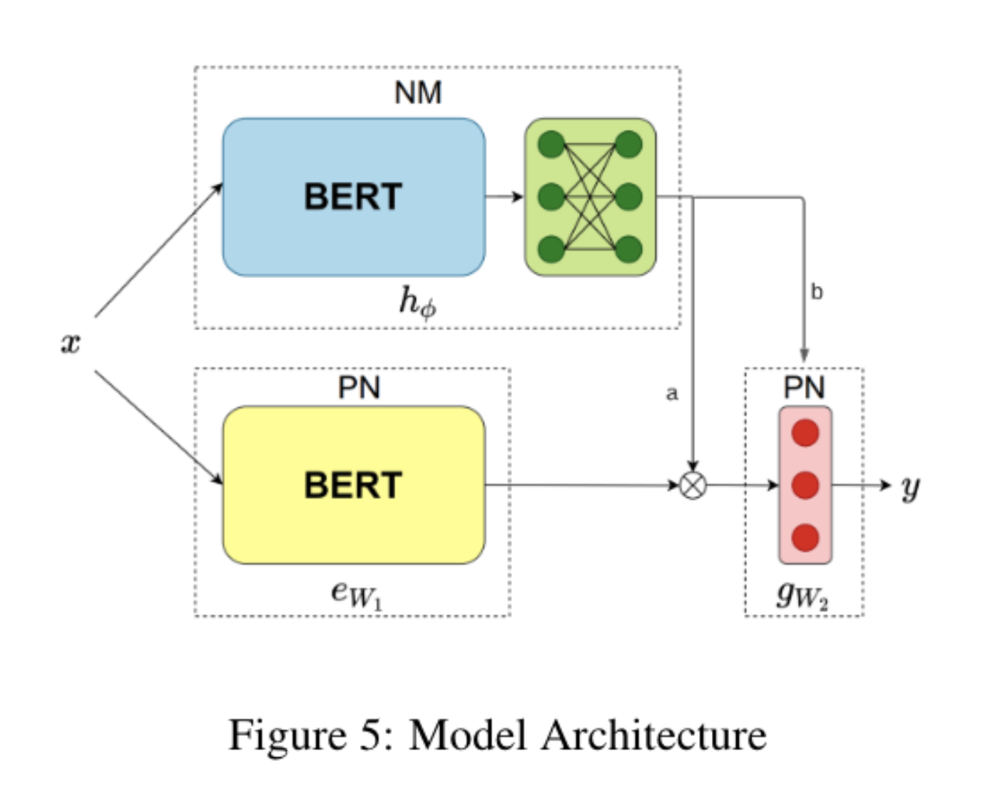

# Neuromodulated Hebbian Plasticity in Sequential Learning Tasks

This code accompanies a group project for Statistical-NLP on Neuromodulated Hebbian Plasticity in Sequential Learning Tasks.

This code takes as a starting point the work carried out by Holla et. al.  on Meta-Learning with Sparse Experience Replay for Lifelong Language Learning. The code can be found [here](https://github.com/Nithin-Holla/MetaLifelongLanguage).

The original contribution contained in this repository is the inclusion of a plastic prediction layer as well as modifications to the way modulation is done.

## Running the code

- Downloads data to a /data directory at the root of this project.
- The main entry point for the program is runner.py

# Architectures

Among the different command line options which can be found in runner.py is 'modulation' and 'out_layer'.

- out_lay controls the prediction network type. Running with 'plastic' will use a Hebbian plasticity network.
- modulation controls how modulation works. Input corresponds to A modulation (in the diagram below) whilst  double corresponds to A and B.

 